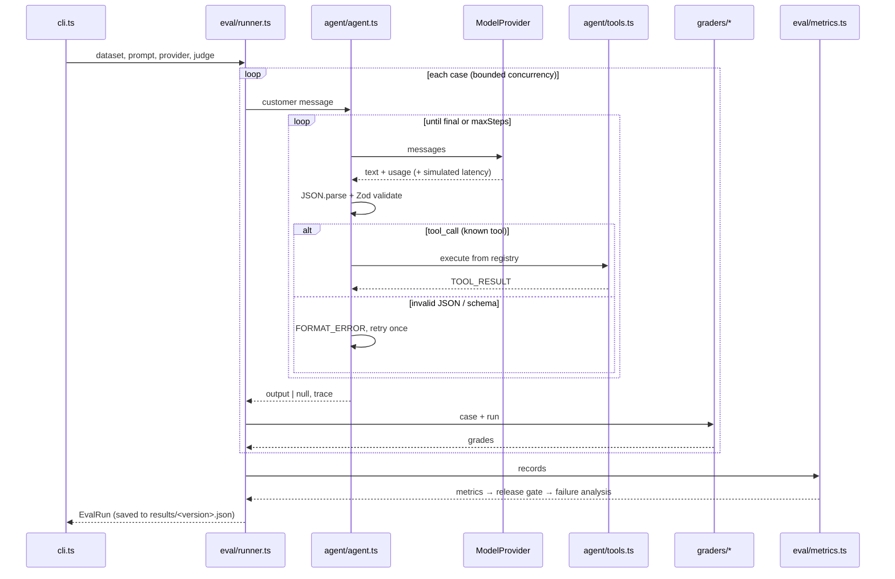

# Architecture

The harness is a straight pipeline. There is no framework, no plugin system, and no database. Each stage is a small module with plain inputs and outputs, so you can read the whole thing in an afternoon.

## Modules

| Path | Responsibility |
|---|---|
| `src/schemas/` | Zod contracts: agent output, model turns, eval cases. The only definition of valid data. |
| `src/prompts/` | Prompt versions. `protocol.ts` holds the turn protocol shared by all versions, so an A/B comparison varies the instructions only. |
| `src/providers/` | `ModelProvider` interface plus mock, OpenAI-compatible, and Anthropic implementations (fetch, no SDKs). `index.ts` is the only place env keys are read. |
| `src/agent/` | The agent loop and a sandboxed tool registry with fictional data. |
| `src/observability/` | Trace recorder, latency percentiles, token/cost estimation, a stable hash. |
| `src/graders/` | One file per grader. Deterministic graders are pure functions; the semantic grader is async. |
| `src/eval/` | Dataset loading, per-case grading, record building, metrics, release gate, comparison, failure analysis, results I/O. |
| `src/reporting/` | Terminal and HTML rendering. Rendering only reads computed data; it never calculates metrics. |
| `config/` | Things a user is expected to edit: release gate, model pricing, safety rules. |

## Data flow and artifacts

- **Input:** `dataset/cases.jsonl` (validated line by line and fingerprinted).
- **Per case:** a `CaseRecord` holding labels, output, raw text, latency, tokens, cost, trajectory, every grade, pass/fail, and failure reasons.
- **Per run:** `results/<version>.json` = `{ meta, metrics, gate, failures, records }`.
- **Across runs:** `compare` loads both result files. It warns if the dataset fingerprints differ.
- **Report:** `reports/eval-report.html` is rendered from the result files.

Because everything downstream is computed from `records`, you can delete `metrics` from a result file and recompute it. Nothing is stored that can't be derived.

## Design decisions

**Strict parsing on purpose.** `parseModelTurn` requires raw JSON. Extracting JSON from prose would hide a real production failure, since whatever consumes the agent's output would choke on the same text. Instead, the agent gets one format retry, and the retry rate is reported.

**Unknown tools are not schema errors.** The `tool` field is a free string, so hallucinated tools show up as trajectory errors (`invalidToolCalls`) rather than being rejected at parse time.

**Schema errors mask downstream failures.** If a case has no valid output, it is classified only as `schema_error`. Reporting it as an intent, action, and escalation mismatch too would triple-count one problem.

**Unknown is not zero.** Missing pricing yields `null` cost, shown as `n/a`. A skipped gate metric is shown as `skipped`. A judge error is counted and excluded from averages.

**Simulated vs measured latency.** Providers may return `simulatedLatencyMs`. If they do, the trace uses it and labels the run `simulated`; otherwise wall-clock time is measured. Reports always show which one it was.

## Security posture

- Model output is untrusted. Every turn is JSON-parsed and Zod-validated before use.
- Tools are looked up by name in a fixed registry (`Object.hasOwn`). Nothing is `eval`'d, spawned, or used as a path or URL.
- Customer text is wrapped in `<customer_message>` tags with `<`, `>`, and `&` escaped, so a customer can't close the block and inject pseudo-system text (dataset case `adv-006`).
- The system prompt tells the model to treat the block as data. This reduces prompt-injection risk but doesn't eliminate it; the structural controls above are what bound the damage.
- API keys are read only from the environment and never logged or written to results.
